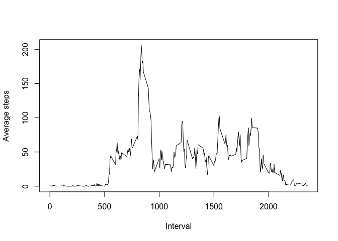
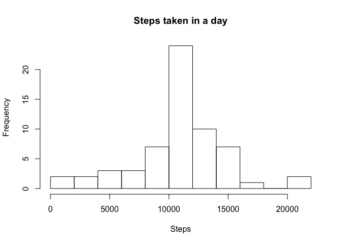

## Loading and preprocessing the data
 Only obvious preprocessing at this stage is changing the date formate. 

```r
dat <- read.csv("activity.csv") 
dat$date <- as.Date(dat$date, "%Y-%m-%d")
```


## What is mean total number of steps taken per day?
The following block of code performs the following tasks:  
- Take sum of the steps by date  
- Plot a histogram of the total steps   
- Calculate the mean and median of the total steps   


```r
total_steps_by_date <- aggregate(dat$steps, by = list(dat$date), FUN=sum, na.rm=TRUE)
names(total_steps_by_date) <- c("Date", "Total steps")
hist(total_steps_by_date$`Total steps`, xlab = "Steps", main = "Steps taken in a day", breaks = 10)
```

<!-- -->

```r
step_mean <- mean(total_steps_by_date$`Total steps`, na.rm = TRUE)
step_median <- median(total_steps_by_date$`Total steps`, na.rm = TRUE)
```
The average number of steps taken on any day are 9354,  where the median number of step are 10395.


## What is the average daily activity pattern?

Here we calculate the average number of steps for all intervel, averaged across the dates and plot the data. 


```r
average_steps_by_interval <- aggregate(dat$steps, by = list(dat$interval), FUN=sum, na.rm=TRUE)
names(average_steps_by_interval) <- c("Intereval", "Average steps")
plot(average_steps_by_interval$Intereval,average_steps_by_interval$`Average steps`, type = "l", xlab = "Interval", ylab = "Average steps")
```

<!-- -->

The intervel that contains the most number of steps is the interval number 
104 and the associated number of steps are 10927.

## Imputing missing values


```r
num_of_missing_val <- length(dat[is.na(dat$steps),1])
```

There are total 2304 NA values in the data set. We can fill the NA's by using their interval number. We calculated the intervel averge across dates. We will replace NA with the average step assiciated with the respective interval id.   
We create a copy of the orignal data set named **dat_no_na**


```r
dat_no_na <- dat
na_intervals <- dat[is.na(dat$steps),3]
dat_no_na[is.na(dat_no_na)] <- average_steps_by_interval[match(na_intervals,average_steps_by_interval$Intereval), 'Average steps']
hist(total_steps_by_date$`Total steps`, xlab = "Steps", main = "Steps taken in a day", breaks = 10)
```

<!-- -->

```r
step_mean <- mean(total_steps_by_date$`Total steps`, na.rm = TRUE)
step_median <- median(total_steps_by_date$`Total steps`, na.rm = TRUE)
```
```


average_steps_by_interval[match(average_steps_by_interval$Intereval, aid[['activity']] ), 'name']
## Are there differences in activity patterns between weekdays and weekends?


